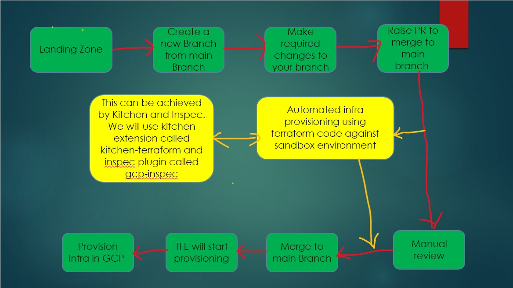

# kitchen-terraform & GCP-Inspec

The kitchen tests are driven by a file called kitchen.yaml

**How they fit together**

|Terraform | Kitchen-Terraform | Triggered By| 
|--- | --- | --- |
|terraform init | KITCHEN CREATE |  kitchen.yaml - Driver|
|terraform apply --auto-approve|kitchen converge|
|NONE|kitchen verify|Inspec profiles|
|terraform destroy|kitchen destroy|

**Kitchen Terraform Plugin**

- This plugin is designed to work with tool test kitchen.
- The tool test kithen is written in Ruby.
- The infra is being launched using terraform driver.
- The verification is done using inspec.

**GCP-Inspec**
- Documentation and source code - https://github.com/inspec/inspec-gcp
