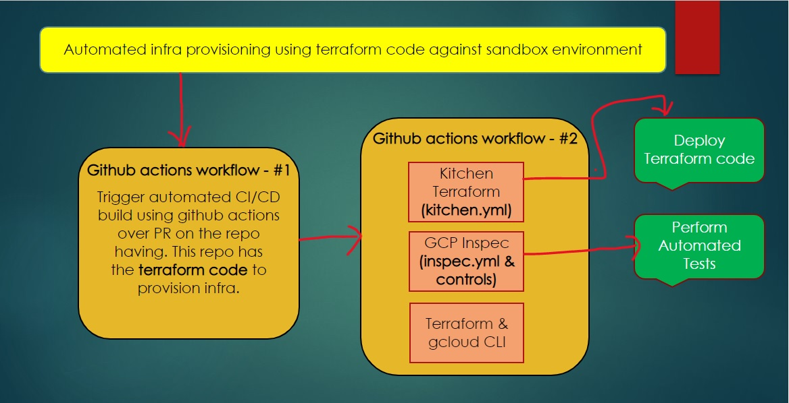

# kitchen-terraform & GCP-Inspec

**Terraform test driven development flow**

**Automated testing setup**

**How they fit together**

|Terraform | Kitchen-Terraform | Triggered By| 
|--- | --- | --- |
|terraform init | kitchen create |  Test Suite - kitchen.yaml - Driver|
|terraform apply --auto-approve|kitchen converge| Test Suite - kitchen.yaml - provisioner|
|NONE|kitchen verify|Inspec profiles| kitchen.yaml - Verifier(inspec.yml + controls)|
|terraform destroy|kitchen destroy|

**Kitchen Terraform Plugin**

- Github - https://github.com/newcontext-oss/kitchen-terraform
- Documentation - https://newcontext-oss.github.io/kitchen-terraform/tutorials/

**GCP-Inspec**
- Documentation and source code - https://github.com/inspec/inspec-gcp